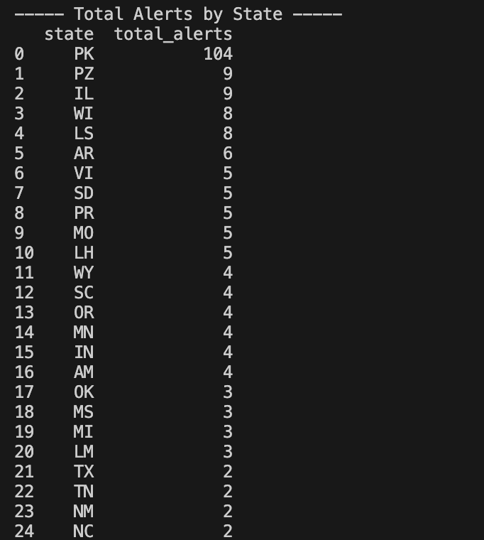
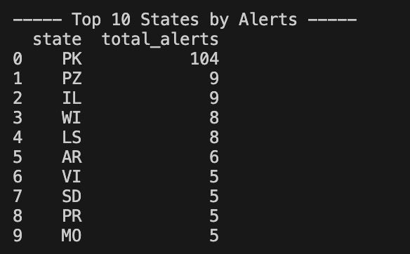
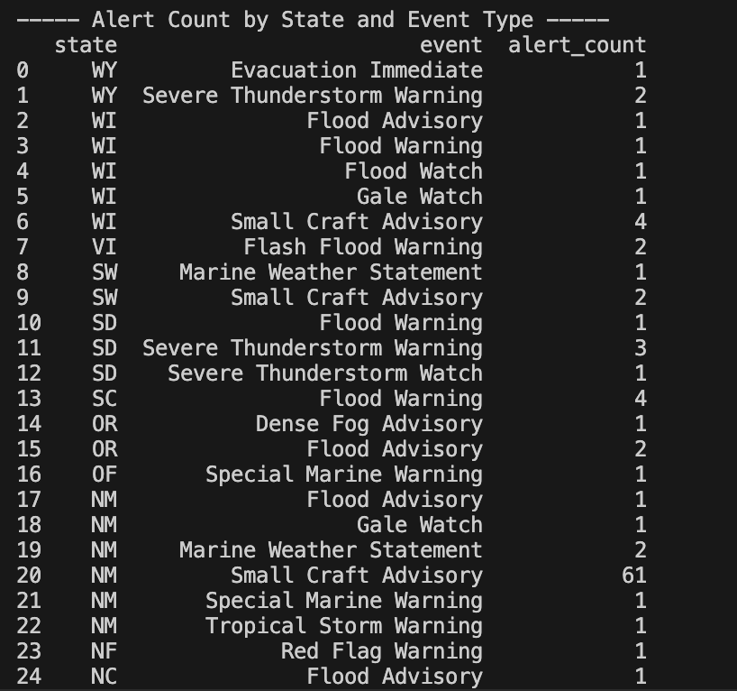
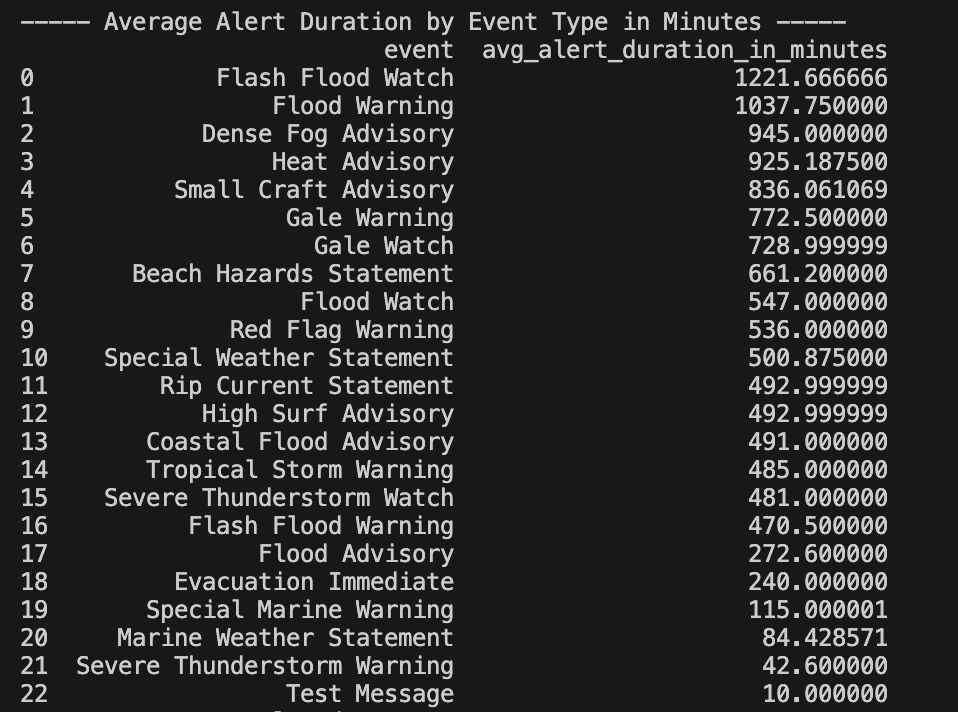

# cotton-holdings-exercise
Coding exercise for Cotton Holdings 

## Purpose
The purpose of this program is to call the weather.gov alerts APIs and save the data to run analytical queries against

## Assumptions and requirements to run this program

Assumption is python3 is installed and cofigured in IDE

Below libraries are needed to successfully run:
```bash
python3 -m pip install requests
python3 -m pip install pandas
python3 -m pip install sqlite3
```
use the below command to run this program 
```bash
python3 main.py
```

## Design Choices and Assumptions
We used the python requests libraries to make external call to the weather.gov alerts API
We called two APIs:
    1. Call https://api.weather.gov/alerts/active/count which gives us back counts of active alerts by state
    2. Call https://api.weather.gov/alerts/active which gives us back all active alerts data 
    3. Full library of API call available can be found here: https://www.weather.gov/documentation/services-web-api#/
Data from these APIs was stored in tables that we created using the python library for sqlite3
We then ran 4 analytical queries against these data sets which will be explained below in the next section

For this program, before we load new entries we are deleting all the data from the tables and loading fresh data after each API call
This is not ideal when looking for historical data, but for the purpose of this execise we are using fresh data each time. Also because I am not too familair with how alerts are generated per day or on each API call from the weather.gov website

## SQL Queries and Results

1. Query to return total active alert counts by state
```SQL
select state, sum(count_of_alerts)  as total_alerts  from alerts_by_state
group by state
order by total_alerts desc
```
Results:



2. Query to return top 10 states with most active alerts count
```SQL
with alert_rank as 
(select state,
 sum(count_of_alerts)  as total_alerts ,
 row_number () over (order by sum(count_of_alerts) desc) as row_num
 from alerts_by_state
group by state
order by total_alerts desc)
select state, total_alerts 
from alert_rank 
where row_num <=10
```

Results:



3. Query to return alert count by state and event type
```SQL
select state,
event,
count(*)  as alert_count
from all_alerts_data
group by state, event
order by state desc
```

Results:



4. Query to return average alert duration based on event type
```SQL
select event, avg((julianday(expire_ts) - julianday(sent_ts))*24*60) as avg_alert_duration_in_minutes
from all_alerts_data
where expire_ts is not null and sent_ts is not null 
group by event
order by avg_alert_duration_in_minutes desc
```

Results:


